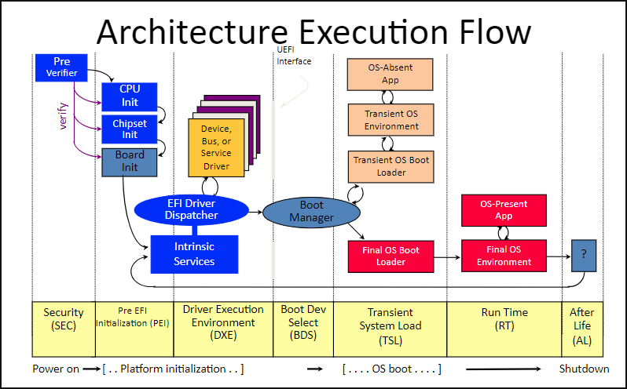

[Back to Index](../index.md)

**Introduction:**  
The PEI foundation is unaware the system boot pat. Only PEIMs know the boot mode and takes appropriate actions based on the boot mode.  
To implement this each PEIM has the ability to change the boot mode using PeiService SetBootMode().  
Change in boot mode doesn’t influence the order of PEIMs dispatched.

**Code Flow:**  
The normal code flow in platform initialization is in the following order.
1. SEC
1. PEI
1. DXE
1. BDS
1. Runtime
1. Afterlife

**Defined Boot modes:**  
The list of possible boot modes is defined in GetBootMode() function.

**Priority of Boot Paths:**  
Within a given PEIM, the priority of the boot mode is from highest to lowest.
1. BOOT_IN_RECOVERY_MODE
1. BOOT_ON_FLASH_UPDATE
1. BOOT_ON_S3_RESUME
1. BOOT_WITH_MINIMAL_CONFIGURATION
1. BOOT_WITH_FULL_CONFIGURATION
1. BOOT_ASSUMING_NO_CONFIGURATION_CHANGES
1. BOOT_WITH_FULL_CONFIGURATION_PLUS_DIAGNOSTICS
1. BOOT_WITH_DEFAULT_SETTINGS
1. BOOT_ON_S4_RESUME
1. BOOT_ON_S5_RESUME
1. BOOT_ON_S2_RESUME

   The boot modes listed above are defined in PEI services SetBootMode().

**Reset Boot Paths:**  
1. Intel Itanium Processor Reset:
The internal microcode on the processor silicon, which starts up at PowerGood reset, finds the first layer of processor abstraction code (called PAL-A) located in the BFV. If the authentication of PAL-A passes, then invokes next layer PAL-B.
1. Non-Power-On Reset:
Non-power-on reset can occur for many reasons. Some PEI and DXE services reset and reboot the entire platform. This can occur due to following reasons.
   1. Resetting processor to change frequency settings
   1. Resetting hardware to complete chipset initialization
   1. Responding to catastrophic failure

**Normal Boot Path:**  
1. Basic G0 to S0 and S0 variation boot paths:
S0 boot path is boot with full configuration. This setting informs all PEIMs to do full configuration.  
   Other supported booth paths:
   1. Boot with minimal configuration
   1. Boot assuming no configuration changes
   1. Boot with full configuration plus diagnostics
   1. Boot with default settings
1. S-State boot paths:
   1. S3 (Suspend to RAM):
Must take extra care to preserve/restore system RAM and critical hardware, assumes previous settings are valid.
   1. S4 (Suspend to Disk):
It is similar to S5, platform completely initializes, assumes previous settings are valid.
   1. S5 (Soft off):
Platform initializes completely, can’t assume previous settings are valid.

**Recovery Paths:**  
All the previously described boot paths can be modified or aborted if the system detects the recovery is needed. Recovery is the process of reconstituting a system’s firmware that have been corrupted. Generally, firmware is present in non-volatile memory as blocks. The reasons for firmware corruption could be a errant hardware or software.

[Back to Index](../index.md)
