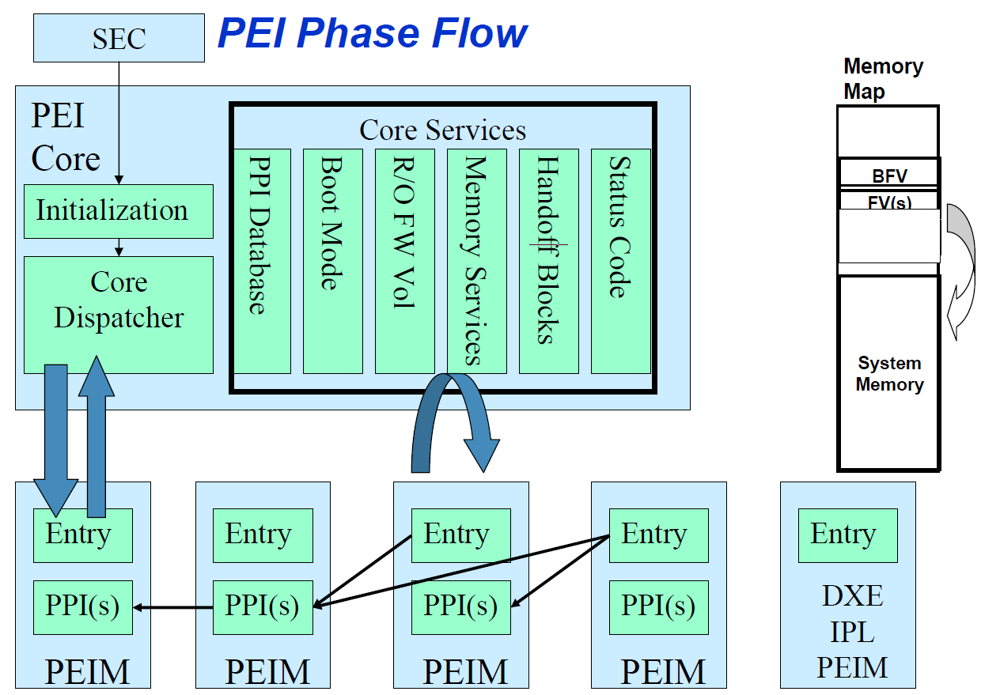

**Introduction:**  
The design for PEI is essentially a miniature version of DXE that addresses many of the same issues. This phase consists of following parts.
1. PEI foundation
1. One or more Pre-EFI Initialization Modules (PEIMs)

PEI is unlike DXE in that DXE assumes that reasonable amount of permanent system RAM are present and available for use. PEI instead assumes that only a limited amount of temporary RAM exists, and it could be reconfigured for other uses during the PEI phase after permanent system RAM has been Initialized.

**Phase Prerequisites:**
1. Temporary RAM:
The PEI foundation requires that the SEC phase initializes a minimum amount of scratch pad RAM that can be used by PEI phase until system memory has been fully initialized. This scratch pad RAM is nothing but the processor internal caches.
1. Boot Firmware Volume (BFV):
BFV contains the PEI foundation and PEIMs. It must appear in the memory address space of the system without prior intervention of firmware. The contents in BFV follows the UEFI PI flash file system to find PEIMs in the BFV. A platform specific PEIM may inform the PEI foundation about the other firmware volumes to find other PEIMs.
1. Security Primitives: SEC phase provides interface to PEI foundation to perform verification operations. To continue the root of trust, PEI foundation use this mechanism to validate various PEIMs.

**Concepts:**  
1. PEI Foundation: This is a single binary executable that is compiled to function with each processor architecture. It has two functions.
   1. Dispatching PEIMs:  
It’s job is to dispatch PEIMs in orderly fashion
   1. Providing common core services used by PEIM
1. Pre-EFI Initialization Modules (PEIMs):  
PEIMs are executable binaries that contains processor, chipset, board specific functionalities embedded inside.  PEIMs reside in ROM image.
1. Pei Services:  
   1. PPI Services: 
Provides services between PEIMs.
   1. Boot Services:  
Manages boot modes (S3, S5, normal boot)
   1. HOB Services:  
Services to create HOB data structures
   1. Firmware Volume Services:  
Scans FFS in firmware volumes to find PEIMs.
   1. PEI Memory Services:  
Provides memory management services for use in both before and after permanent memory is initialized.
   1. Reset Services:  
To initiate system restart
1. PEIM to PEIM Interface (PPI):  
PEIMs may invoke other PEIMs through interfaces named PPIs. The interfaces themselves are named using GUIDs. The PEIM that wants a specific PPI can query the PEI foundation the interface it needs. There are two types of PPIs.
   1. Services:  
PPI services allow a PEIM to provide functions or data for another PEIM to use.
   1. Notifications:  
PPI notifications allow a PEIM to register for a call back function when another PPI is registered with PEI foundation.
1. Simple Heap:  
PEI foundation uses processor cache as temporary RAM to provide a simple heap store before permanent system memory is installed.
1. Hand of Block (HOB):  
These are the data blocks to pass information from PEI phase to DXE phase. It contains two items.
   1. The format of the data section
   1. Total size of the HOB

**Operations:**  
PEI Phase operations consists of invoking PEI foundation, dispatching all PEIMs in orderly manner, discovering and invoking next phase as shown in below figure.

During PEI foundation initialization, it initializes the internal data structures and functions that provide common services to PEIMs.

During PEIMs dispatch, the PEI dispatcher traverses the firmware volumes and discovers PEIMs according to the flash file system definition.

Then PEI dispatcher dispatches PEIMs if the following criteria is met
1. The PEIM has not already been invoked
1. The PEIM file is correctly formatted
1. The PEIM is trustworthy
1. The PEIM’s dependency requirements have been met.

The PEI dispatcher continues traversing through all the firmware volumes until either all discovered PEIMs have been invoked or no more PEIMs can be invoked due to the above requirements not met.

Once all PEI dispatcher job is complete, then it invokes DXE Initial Program Load (IPL) PPI.

1. Dependency Expression:  
The sequence of PEIMs to be dispatched is based on dependency expression. The GUIDs of PPIs and GUIDs of file names are referred in the dependency expression.
1. Verification/Authentication:  
There will be a Security PPI and Verification PPI. The purpose of Verification PPI is to check the authenticate PEIMs using a digital signature, a simple checksum or OEM specific mechanism. The result of authentication is returned to PEI foundation, which in turn conveys the result to the security PPI.
1. PEIM Execution:  
PEIMs will be invoked by PEI foundation. Each PEIM will be invoked only once and must perform its job with that invocation and also installs other PPIs to allow other PEIMs to run. PEIMs may register for call back if it is necessary for the PEIM to get control again after another PEIM has run.
1. Memory Discovery:  
When a PEIM successfully discovered, initialized and tested contiguous range of system RAM, it reports RAM to the PEI foundation. Then PEI foundation migrates use of temporary RAM to real RAM. Which involves the following two tasks.
   1. The PEI foundation must switch stack usage from temporary RAM to permanent RAM.
   1. The PEI foundation must migrate simple heap allocated by PEIMs in temporary RAM to permanent RAM.

   Then install architectural PPI to notify other PEIMs that real system memory has been initialized. So that PEIMs can now build HOBs need to be passed for next phase.
1. Itanium MP considerations
1. Recovery:  
Recovery is the process of reconstituting a systems firmware device when they have been corrupted.
1. S3 Resume:  
The PEI phase in S3 boot differs from normal boot. The differences are as follows.
   1. The memory subsection is restored to its pre-sleep rather than initialized
   1. System memory owned by OS is not used by any PEIM
   1. DXE phase is not dispatched
   1. Instead of dispatching DXE phase, uses a special hardware table to restore fundamental hardware back to boot configuration
